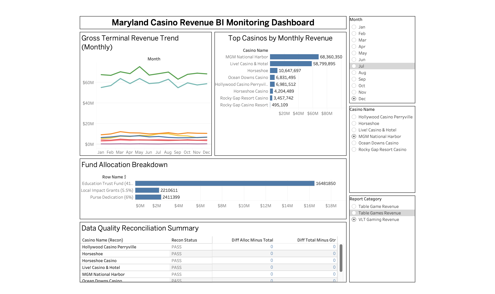

# Maryland Casino Revenue BI Monitoring (PDF → SQL → Tableau)

## Overview
This project demonstrates an end-to-end Business Intelligence pipeline built using real-world financial reporting data.

Maryland casino revenue reports are published monthly as unstructured PDF documents. Manual reporting and validation is time-consuming and prone to reconciliation issues.

**Workflow:** PDF Extraction → Structured Dataset → MySQL BI Model → Tableau Dashboard

---

## Business Problem
Casino revenue reports include:
- Gross Terminal Revenue (GTR)
- Total reported revenue
- Banked and Non-Banked game revenue
- Fund allocation line items

Stakeholders need:
- Monthly revenue monitoring
- Casino performance ranking
- Allocation breakdown
- Data quality validation (Totals vs Allocations)

---

## Solution Implemented

### Data Extraction (Python)
- Extracted multi-page PDF revenue reports using `pdfplumber`
- Cleaned and normalized numeric fields
- Generated structured, analytics-ready dataset

### Data Modeling (MySQL)
- Loaded data into a staging table
- Built a simplified fact table with parsed fields:
  - `report_category`
  - `casino_name`
  - `line_type` (TOTAL, GTR, BANKED, NON_BANKED, ALLOCATION)

### Data Validation (Reconciliation Logic)
Rules implemented:
- TOTAL must equal GTR
- If banked/non-banked rows exist: Banked + Non-Banked must equal GTR
- Allocation sum must match TOTAL

### Visualization (Tableau)
Dashboard includes:
- Monthly GTR trend
- Top casinos ranking
- Allocation breakdown
- Reconciliation summary (PASS/FAIL)

---

## Tech Stack
- Python (pdfplumber, pandas)
- MySQL (SQL modeling + reconciliation checks)
- Tableau (dashboarding)

---
